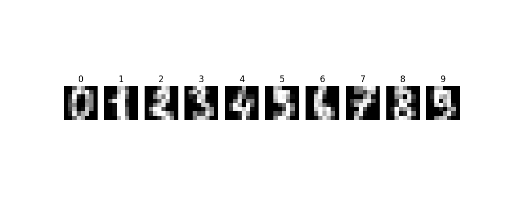
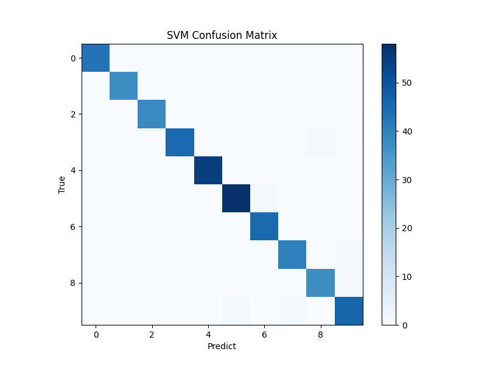
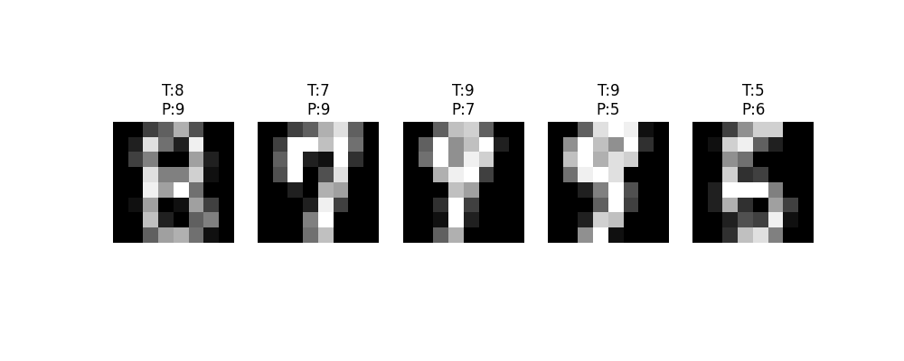

# 传统机器学习方法用于手写数字图像分类实验报告
学号：2023102949   姓名：李臻

---

## 一、实验目的
1. 理解图像如何转换为机器学习模型可以处理的特征向量。
2. 理解训练集和测试集的基本概念与作用。
3. 掌握常见传统机器学习分类方法的基本使用。
4. 对比不同分类器在同一图像分类任务中的表现差异。
5. 学会使用准确率、混淆矩阵和错误样本分析评价分类结果。

---

## 二、数据集说明
1. **数据集名称**：sklearn 自带 digits 手写数字数据集
2. **图像大小**：8 × 8 灰度图像
3. **样本数量**：1797 张
4. **类别数量**：10 类（0~9）
5. **特征表示**：将 8×8 二维图像按像素展平，转换为 64 维特征向量，用于传统机器学习模型训练。

### 样本图像展示

---

## 三、实验方法
本实验使用以下6种传统机器学习分类方法：

| 方法 | 简要说明 |
|------|----------|
| KNN | 根据最近邻样本投票分类 |
| Naive Bayes | 根据概率模型进行分类 |
| Logistic Regression | 学习线性分类边界 |
| SVM | 寻找最大间隔分类超平面 |
| Decision Tree | 根据特征阈值逐步分类 |
| Random Forest | 多棵决策树集成投票分类 |

---

## 四、实验结果

### 4.1 数据基本信息
- 图像总数：1797
- 图像大小：(8, 8)
- 标签范围：0~9

### 4.2 数据集划分
- 训练集：(1347, 64)，用于模型训练
- 测试集：(450, 64)，用于模型评估

### 4.3 特征表示
8×8 图像展平为 64 维向量。
传统机器学习模型无法直接处理二维图像，必须转换为一维特征向量。
原始像素特征优点：简单易实现；缺点：对位移、旋转、缩放敏感，缺乏结构信息。

### 4.4 各模型测试准确率
| 模型 | 测试准确率 |
|------|------------|
| KNN | 0.9933 |
| Naive Bayes | 0.8556 |
| Logistic Regression | 0.9733 |
| SVM | 0.9867 |
| Decision Tree | 0.8489 |
| Random Forest | 0.9800 |

### 4.5 结果分析
- 准确率最高模型：**KNN**
- 准确率最低模型：**Decision Tree**
- 模型间表现差异明显，原因是不同模型对像素特征的拟合能力、泛化能力、假设条件不同。

### 4.6 混淆矩阵（SVM模型）

### 4.7 错误分类样本分析

易混淆数字多为字形相近的数字（如 3/5、8/9、4/9）。
错误原因：8×8 分辨率较低、笔画模糊；原始像素特征对微小形变敏感；相似数字像素分布接近。

---

## 五、实验总结
1. 掌握了传统机器学习方法处理图像分类的完整流程：图像加载 → 特征展平 → 数据集划分 → 模型训练 → 评估分析。
2. 对比了多种分类器的优缺点：KNN、SVM、随机森林在本任务表现优秀；决策树与朴素贝叶斯较弱。
3. 认识到原始像素特征的局限性：对平移、旋转、缩放非常敏感，缺乏空间结构信息。
4. 学会使用准确率、混淆矩阵、错误样本进行模型效果评估。

---

## 六、思考题回答
1. **为什么传统机器学习需要先把图像转换为特征向量？**
传统机器学习模型的输入要求是一维特征向量，不能直接接收二维图像，因此必须展平或提取特征。

2. **KNN、SVM、决策树、随机森林的分类思想有什么不同？**
- KNN：依靠邻近样本投票
- SVM：寻找最大间隔分类面
- 决策树：按特征阈值逐层判断
- 随机森林：多棵树随机采样后投票

3. **为什么单棵决策树容易过拟合？**
决策树会过度学习训练集细节与噪声，导致泛化能力下降。

4. **为什么随机森林更稳定？**
多棵树随机选取数据与特征，集成后降低过拟合，提升鲁棒性。

5. **图像发生平移、旋转、缩放时，原始像素特征会有什么问题？**
像素位置发生变化，特征向量分布改变，模型识别能力大幅下降。
